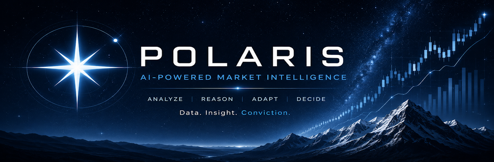

<p align="center">
  
</p>

<p align="center">
  <a href="#project-status"></a>
  <a href="pyproject.toml"></a>
  <a href="pyproject.toml"></a>
  <a href="docs/postgres_persistence.md"></a>
  <a href="docs/platform_rag_pipeline.md"></a>
  <a href="docs/core_telemetry_observability.md"></a>
</p>

<h1 align="center">Polaris</h1>

<p align="center">
  <strong>A runtime-native AI intelligence platform for portfolio analysis, risk assessment, strategy synthesis, and financial reporting.</strong>
</p>

<p align="center">
  <a href="#what-is-polaris">What is Polaris?</a> ·
  <a href="#feature-matrix">Features</a> ·
  <a href="#how-it-works">Architecture</a> ·
  <a href="#quick-start">Quick start</a> ·
  <a href="#cli-usage">CLI</a> ·
  <a href="#documentation">Docs</a>
</p>

---

## Project status

> [!IMPORTANT]
> **Polaris is a work in progress.** The platform is under active development and is not yet a stable public API, production trading system, or investment advisory product. Interfaces, schemas, workflows, and defaults may change as the architecture matures.

Polaris is recommendation-oriented. It can analyze markets and portfolios, generate reports, produce strategy and risk assessments, inspect historical runs, and run deterministic simulations. It does **not** place live broker orders or autonomously trade capital.

> [!WARNING]
> Polaris is research and decision-support software. Outputs are not financial, investment, legal, tax, or trading advice. Always verify data and decisions independently before acting.

## What is Polaris?

Polaris is a Python platform for building replayable AI-assisted portfolio-management workflows. It combines typed application services, provider-based market integrations, a workflow runtime, persisted execution evidence, curated RAG, and observability into one platform-native architecture.

Polaris is designed to answer questions such as:

- What changed in market conditions since the last report?
- What does the current technical, macro, sentiment, news, portfolio, and risk picture look like?
- Why did the platform produce a recommendation or risk assessment?
- What evidence and node outputs contributed to a completed workflow run?
- How would a strategy or workflow behave under deterministic historical or simulated inputs?
- Which curated records should be used for grounded RAG-backed answers?

## Feature matrix

| Capability | Status | Description |
| --- | --- | --- |
| Runtime-native workflows | Active | Registered workflows execute through the canonical runtime, node graph, events, checkpoints, and completed-run persistence. |
| Morning report | Active | Produces a human-readable financial report with terminal output and optional Markdown, HTML, JSON, or PDF artifacts. |
| Portfolio intelligence | Active | Builds portfolio state, risk context, strategy inputs, and recommendation surfaces from typed services and providers. |
| Technical and breadth analysis | Active | Provides market snapshots, indicators, volatility, breadth, trend, regime, and calibrated technical scores. |
| Strategy synthesis | Active | Combines market, portfolio, risk, and intelligence outputs into strategy-oriented recommendations and rationale. |
| PostgreSQL persistence | Active | PostgreSQL is the durable system of record for workflows, reports, signals, recommendations, telemetry, backtests, and curated RAG records. |
| Platform-native RAG | Active | Curated PostgreSQL records project into Qdrant and Neo4j for hybrid retrieval, graph context, reranking, CRAG, Self-RAG, and answer logging. |
| Completed-run replay and inspection | Active | Completed runtime contexts are persisted for audit, inspection, report history, and downstream curation. |
| Deterministic backtesting | Active | Backtests use the production runtime with simulated or historical providers; the runtime remains unaware of live versus simulated execution. |
| Observability | Active | Structured logs, metrics, traces, provider telemetry, OpenTelemetry, Prometheus, Jaeger, Grafana, and PostgreSQL telemetry retention are supported. |
| MCP server | Active / evolving | `polaris-mcp` exposes selected read-only platform capabilities as a thin MCP transport over canonical application services. |
| HTTP API | Scaffolded | API package exists, but the native maintained interface is currently the CLI. |
| Live brokerage execution | Out of scope | Polaris does not currently submit live orders or operate as an autonomous trading bot. |

## How it works

Polaris follows an inside-out architecture. The runtime is the trunk; application services, integrations, intelligence, reporting, CLI, MCP, and future interfaces are branches.

```text
Interface: CLI / MCP / future API
    -> WorkflowFacade
    -> WorkflowBootstrap + Dishka request scope
    -> RuntimeEngine
    -> RuntimeNode graph
    -> RuntimeNodeOutput
    -> RuntimeContext
    -> PostgreSQL completed-run and domain persistence
    -> Curated records
    -> Qdrant / Neo4j RAG projections
    -> Reports, answers, audit, and inspection
```

External data enters through a strict service/provider/client boundary:

```text
Application service
    -> provider protocol
    -> vendor-specific async client
    -> external system
```

This keeps vendor SDKs and transport concerns out of intelligence agents and workflow nodes. Internal platform contracts are strongly typed; dictionaries are reserved for external APIs, telemetry, persistence serialization, runtime boundaries, and transport payloads.

### Why Polaris is designed this way

| Design choice | Why it matters |
| --- | --- |
| Runtime-first workflows | Live analysis, replay, inspection, and backtesting use the same execution path instead of separate runtimes. |
| Typed internal contracts | Signals, requests, results, recommendations, and runtime outputs are discoverable, testable, and safer to refactor. |
| PostgreSQL as system of record | Durable business state, workflow evidence, curated records, and audit trails have one authoritative home. |
| Rebuildable projections | Qdrant and Neo4j can be rebuilt from PostgreSQL without becoming competing sources of truth. |
| Provider composition | Live, historical, and simulated data can be swapped at the boundary while the runtime remains unchanged. |
| Observable boundaries | Provider calls, datastore work, runtime events, and long-running operations emit logs, metrics, and traces once at their canonical owner. |
| Curated RAG eligibility | Not every node output becomes permanent knowledge; only explicit, typed, attributable records are projected into RAG. |

## Portfolio-management use cases

Polaris can be used as a decision-support platform for portfolio workflows such as:

- generating a daily or intraday market and portfolio morning report;
- evaluating current portfolio risk, concentration, volatility, and drawdown context;
- combining technical, macro, sentiment, news, and portfolio evidence into strategy rationale;
- reviewing historical recommendations and completed workflow outputs;
- asking grounded RAG-backed questions over curated platform records;
- testing deterministic scenarios with fixed inputs and independently verified expected outcomes;
- monitoring providers, data quality, workflow execution, and observability signals.

## Core components

| Layer | Key packages | Responsibility |
| --- | --- | --- |
| Runtime | `core/runtime`, `core/workflow` | Workflow graph execution, control, events, checkpoints, replay, policy, governance, and completed-run evidence. |
| Application | `application/services`, `application/rag`, `application/persistence` | Typed use-case orchestration, RAG operations, persistence services, and application boundaries. |
| Integration | `integration/clients`, `integration/providers` | Vendor clients, provider protocols, live providers, and backtesting providers. |
| Intelligence | `intelligence` | Analysts, portfolio/risk/strategy agents, research nodes, and domain signal production. |
| Persistence | `core/database`, `core/storage/persistence`, `alembic` | SQLAlchemy models, migrations, repositories, retention, and PostgreSQL-backed system-of-record storage. |
| Interfaces | `interfaces/cli`, `mcp_server` | Typer CLI and MCP tools that delegate to canonical services. |
| Operations | `deployment`, `docs/core_telemetry_observability.md` | Prometheus, Jaeger, Grafana, logs, metrics, traces, and local service operations. |

## Quick start

### Prerequisites

- Python **3.12+**
- [`uv`](https://docs.astral.sh/uv/) for dependency management
- Docker Compose for local infrastructure
- Optional: NVIDIA GPU support for the local BGE reranker container

### 1. Clone and install

```bash
git clone <your-polaris-repo-url>
cd polaris
uv sync
```

### 2. Configure environment

```bash
cp .env.example .env
```

Edit `.env` and set local secrets. At minimum, local Docker services require values for:

```text
POLARIS_POSTGRES_PASSWORD=
NEO4J_AUTH=
GRAFANA_ADMIN_PASSWORD=
```

Optional provider/API credentials include Alpaca, Alpha Vantage, FRED, NewsAPI, Massive, LiteLLM-backed model endpoints, and other data vendors listed in `.env.example`. Local web fallback uses SearXNG for discovery and Crawl4AI for content acquisition.

> [!CAUTION]
> Do not commit `.env`, API keys, passwords, authenticated database URLs, or vendor tokens.

### 3. Start local infrastructure

```bash
docker compose up -d postgres qdrant neo4j litellm
```

Optional observability and RAG support services:

```bash
docker compose up -d prometheus jaeger grafana
# Optional reranker; requires the configured local model volume/GPU environment.
docker compose up -d bge-reranker
# Optional local web-search discovery for explicit RAG web fallback.
docker compose up -d searxng
```

Optional RAG web fallback also requires Crawl4AI browser setup on the host:

```bash
uv run crawl4ai-setup
uv run crawl4ai-doctor
# If browser dependencies are missing:
uv run python -m playwright install --with-deps chromium
```

Web fallback remains disabled by default and must be enabled in `.env` and per request. SearXNG only performs search/discovery; Crawl4AI performs concurrent content acquisition and Markdown extraction. Returned web evidence is transient and untrusted unless explicitly curated later.

LiteLLM is the canonical local LLM gateway. Polaris sends logical model names to LiteLLM; LiteLLM routes them to configured backends such as host Ollama. If the LiteLLM container routes to host Ollama, make Ollama container-reachable with `OLLAMA_HOST=0.0.0.0:11434` or set `POLARIS_LITELLM_OLLAMA_API_BASE` to another reachable endpoint.

### 4. Apply database migrations

```bash
uv run alembic upgrade head
```

### 5. Verify the CLI

```bash
uv run polaris --help
uv run polaris inspect config
uv run polaris workflow list
```

## CLI usage

### Morning report

```bash
uv run polaris morning-report
uv run polaris morning-report --symbol SPY
```

Terminal output, progress notifications, and interactive workflow control are enabled by default. Use `--format` when you also want a file artifact:

```bash
uv run polaris morning-report --format markdown
uv run polaris morning-report --format html
uv run polaris morning-report --format json
uv run polaris morning-report --format pdf
```

### Workflows

```bash
uv run polaris workflow list
uv run polaris workflow describe morning_report
uv run polaris workflow run morning_report
```

### Completed runs

```bash
uv run polaris runs list morning_report
uv run polaris runs show morning_report <execution_id>
```

### RAG

```bash
uv run polaris rag status
uv run polaris rag ingest --source reports
uv run polaris rag process-embeddings
uv run polaris rag process-graph
uv run polaris rag ask "What changed in the latest portfolio risk assessment?"
```

RAG uses PostgreSQL as the canonical source, Qdrant for hybrid vector projection, Neo4j for graph projection, BGE reranking, and optional SearXNG + Crawl4AI transient web fallback depending on configuration and service availability.

### Backtesting

```bash
uv run polaris backtest --help
uv run polaris backtest run --scenario path/to/scenario.yaml
```

Backtests run through the same production workflow runtime and swap data providers through composition. Deterministic scenarios should use fixed inputs, time, seeds, and independently derived expected outcomes.

### MCP server

```bash
uv run polaris-mcp --help
```

The MCP server is intended for external LLM-agent hosts that need controlled access to Polaris. It is a thin transport over canonical application services, not a second RAG, persistence, or workflow implementation.

## Platform-native RAG

Polaris RAG is designed around curated records rather than raw dumps.

```text
Curated PostgreSQL records
    -> canonical RAG documents and chunks
    -> embedding and graph projection jobs
    -> Qdrant and Neo4j projections
    -> hybrid retrieval, reranking, CRAG, Self-RAG, and answer logs
```

Important rules:

- PostgreSQL remains authoritative.
- Qdrant and Neo4j are rebuildable projections.
- SearXNG + Crawl4AI web evidence is transient unless explicitly curated later.
- RAG documents are generated only from eligible, typed, attributable records.
- Query and answer logs are persisted for audit and inspection.

See [`docs/platform_rag_pipeline.md`](docs/platform_rag_pipeline.md) for the full architecture.

## Observability

Polaris includes core observability for local development and platform operations:

| Signal | Tooling |
| --- | --- |
| Logs | Structured Python logging at canonical boundaries |
| Metrics | Prometheus-compatible counters and histograms |
| Traces | OpenTelemetry spans exported to Jaeger |
| Dashboards | Grafana provisioning under `deployment/grafana` |
| Persistence | PostgreSQL telemetry records and retention policies |

Useful local endpoints when services are running:

| Service | URL |
| --- | --- |
| Prometheus | <http://localhost:9090> |
| Jaeger | <http://localhost:16686> |
| Grafana | <http://localhost:3000> |
| Neo4j Browser | <http://localhost:7474> |
| Qdrant | <http://localhost:6333> |

See [`docs/core_telemetry_observability.md`](docs/core_telemetry_observability.md).

## Development

Common checks:

```bash
uv run ruff check .
uv run ruff format .
uv run mypy . --explicit-package-bases
uv run pytest
```

Database validation:

```bash
uv run alembic upgrade head
uv run alembic check
uv run pytest -q tests/database/test_migrations.py
```

After meaningful Python architecture changes, update the local code graph:

```bash
uv run graphify update .
```

## Documentation

| Document | Description |
| --- | --- |
| [`docs/platform_architecture_and_operations.md`](docs/platform_architecture_and_operations.md) | Runtime, workflow, DI, persistence, telemetry, and operations overview. |
| [`docs/postgres_persistence.md`](docs/postgres_persistence.md) | PostgreSQL setup, migrations, schema ownership, and validation. |
| [`docs/platform_rag_pipeline.md`](docs/platform_rag_pipeline.md) | RAG architecture, chunking, model configuration, projections, and operations. |
| [`docs/backtesting_system.md`](docs/backtesting_system.md) | Runtime-native deterministic backtesting design and usage. |
| [`docs/platform_mcp_server.md`](docs/platform_mcp_server.md) | MCP server boundary and tool catalog guidance. |
| [`docs/core_telemetry_observability.md`](docs/core_telemetry_observability.md) | Prometheus, Jaeger, Grafana, tracing, metrics, and telemetry persistence. |
| [`docs/decisions/`](docs/decisions/) | Accepted architectural decision records. |

## Public roadmap themes

Polaris is actively evolving. Near-term public-facing work may include:

- stronger installation and sample-data workflows;
- additional deterministic backtesting scenarios;
- expanded MCP tool coverage for approved external agent hosts;
- more curated-record projection coverage;
- improved web/API interfaces;
- deeper governance, approval, and policy workflows;
- broader test coverage and release hardening.

## Contributing

Contributions are welcome once the public contribution process is finalized. For now, open an issue or discussion with:

- the problem you are trying to solve;
- the workflow, service, provider, or interface involved;
- whether the change affects runtime contracts, persistence schema, RAG projections, or telemetry;
- the verification you expect to run.

Please keep changes surgical, typed, observable, and aligned with the canonical runtime and persistence boundaries.
