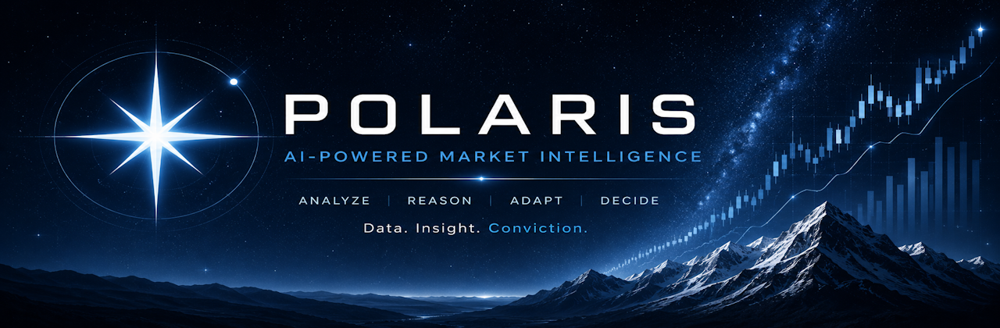

# Polaris



Polaris exists to help humans make **better, more trustworthy portfolio and investment decisions**.

It turns fragmented market, portfolio, research, portfolio-risk, and model evidence into a repeatable decision process that can support explainable Investment Recommendations, attributable Human Investment Decisions, durable decision history, and later Decision Evaluation.

## Greenfield rebuild

Polaris is currently being rebuilt as a greenfield system around the Investment Decision lifecycle and Durable Decision Memory.

The repository intentionally does **not** preserve the previous implementation architecture as the new baseline. Product and domain semantics are established first; requirements and target architecture follow; legacy implementation is inspected only afterward for components that independently earn reuse.

The current greenfield implementation surface is therefore deliberately minimal.

## Repository boundaries

- `src/polaris/` — canonical source package for the new Polaris implementation.
- `legacy/v0_1/` — historical pre-greenfield platform retained only as donor/reference material.
- `CONTEXT.md` — canonical domain vocabulary.
- `docs/product/` — durable product and domain doctrine.
- `docs/current/` and `docs/adr/` — current architecture and accepted architectural decisions.
- `wiki/` — active Living Entity Wiki: derived architectural memory and the authoritative registry of active Entity IDs used by classified document naming.
- `docs/process/` and `.agents/` — current repository/workflow process infrastructure.
- `assets/` — Polaris project branding.

### Legacy isolation

New Polaris code, tests, configuration, migrations, and runtime paths must never import, wrap, extend, execute through, or otherwise depend on `legacy/`.

Legacy code may be studied and selectively transplanted only after a current product need and architectural owner have been independently established. Existing abstractions, dependencies, schemas, workflows, tests, and architecture do not survive merely because they already exist.

The pristine pre-greenfield implementation is anchored by the Git tag `legacy-v0.1-baseline`.

## Current status

The repository has completed its product/domain reset, greenfield cutover, requirements, and R1 architecture. R2 is now defining the durable Investment Decision kernel and historical-truth implementation boundary.

```text
approved product/domain + requirements
  ↓
approved greenfield architecture
  ↓
Living Entity Wiki + entity-derived document naming
  ↓
R2 component boundaries
  ↓
Specs / tickets
  ↓
inside-out implementation + selective donor salvage
```

No production capability should be inferred from the historical implementation under `legacy/` or from the existence of the new package boundary alone.

## License

Polaris is licensed under the Apache License 2.0. See [LICENSE](LICENSE).
