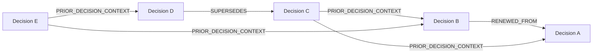

# Investment Decision Relationship Model

**Status:** Proposed  
**Release:** 0.2.0  
**Primary entity:** `investment-decisions`  
**Roadmap milestone:** R2 — Durable decision kernel and historical truth  
**Purpose:** Define typed relationships among Investment Decisions so lifecycle lineage, materially used prior-decision context, and graph-shaped Decision Memory remain explicit without turning an Investment Decision into a graph container or requiring graph-database infrastructure.

## Authority

This design refines, but does not override:

- [`../current/platform-architecture-0.2.0.md`](../current/platform-architecture-0.2.0.md);
- [`investment-decisions-r2-decision-kernel-component-boundaries.md`](investment-decisions-r2-decision-kernel-component-boundaries.md);
- [`platform-domain-interaction-map.md`](platform-domain-interaction-map.md);
- [`investment-decisions-lifecycle-model.md`](investment-decisions-lifecycle-model.md);
- [`application-use-cases-investment-decision-lifecycle.md`](application-use-cases-investment-decision-lifecycle.md);
- [`durable-persistence-investment-decision-history.md`](durable-persistence-investment-decision-history.md);
- [`../product/requirements-0.2.0.md`](../product/requirements-0.2.0.md);
- [`../product/domain-model.md`](../product/domain-model.md) and [`../../CONTEXT.md`](../../CONTEXT.md);
- accepted ADRs under [`../adr/`](../adr/).

This document fills a deliberate design gap in the first R2 design pass: lifecycle-causal relationships existed, but broader durable relationships showing that one prior Investment Decision materially informed another had not yet been modeled.

`legacy/v0_1/` is not a relationship-model source.

---

# 1. Design objective

Polaris must be able to distinguish:

1. a prior Investment Decision that is the lifecycle predecessor of a newer Decision;
2. a prior Investment Decision that was materially used as context for another Decision;
3. a Decision that merely appeared in search/retrieval results but was never materially used;
4. a Lesson, Evidence item, View, Recommendation, or other owner-specific fact that influenced later work without flattening that influence into a generic Decision-to-Decision claim.

The model must preserve those distinctions historically and make them queryable without:

- embedding mutable lists of related Decision IDs inside the Investment Decision aggregate;
- treating retrieval similarity as durable business truth;
- forcing all relationships into one generic untyped edge;
- requiring a graph database;
- allowing relationship creation to redefine Investment Decision identity.

The resulting logical model is graph-shaped, but graph traversal is a query capability rather than a new source of business authority.

---

# 2. Core rule: Decision relationships are separate durable facts

An Investment Decision does not discover, assign, or mutate arbitrary relationships to other Investment Decisions by itself.

Instead:

```text
Application Use Case
        ↓
selects/coordinates a relationship operation
        ↓
Investment Decisions validates relationship semantics
        ↓
Durable Persistence commits the typed relationship
        ↓
Decision Memory queries may traverse it later
```

The relationship is a first-class durable fact referencing two independently durable Investment Decision identities.

The Investment Decision aggregate remains responsible for its own lifecycle state and invariants. It does not become a container holding an ever-growing `related_decisions` collection.

---

# 3. Relationship classes

The design separates two classes of Decision-to-Decision relationship.

## 3.1 Lifecycle lineage relationships

These relationships change or explain lifecycle continuity itself.

R2 requires:

### `RENEWED_FROM`

Direction:

```text
new Decision ──RENEWED_FROM──> prior terminal Decision
```

Meaning:

A new coherent unresolved choice was established after an earlier Decision had already been substantively or externally resolved, and the new Decision is explicitly a renewal of judgment related to that earlier Decision.

Rules:

- source and target Decision IDs must differ;
- target must already be `RESOLVED` or `EXTERNALLY_RESOLVED` when the relationship is established;
- source is a newly established Decision identity;
- the relationship does not reopen or mutate the target;
- one source Decision has at most one canonical `RENEWED_FROM` predecessor in R2;
- later contextual links may point to additional earlier Decisions without changing this canonical predecessor.

### `SUPERSEDES`

Direction:

```text
successor Decision ──SUPERSEDES──> predecessor Decision
```

Meaning:

A newly established Decision intentionally replaces an existing unresolved Decision as the coherent choice that should continue forward.

Rules:

- source and target Decision IDs must differ;
- target must be `ACTIVE` or `DEFERRED` immediately before the atomic Supersession operation;
- source is a newly established Decision identity;
- target becomes `SUPERSEDED` in the same semantic transaction;
- source has at most one canonical Supersession predecessor in R2;
- target has at most one canonical direct Supersession successor in R2;
- Supersession does not copy predecessor facts into successor ownership.

The inverse query labels `RENEWED_BY` and `SUPERSEDED_BY` may be exposed as derived navigation terms. They do not require separately persisted reverse facts.

## 3.2 Material context relationships

Lifecycle lineage is too narrow to represent every prior Decision that materially informed a current Decision.

The planned contextual relationship is:

### `PRIOR_DECISION_CONTEXT`

Direction:

```text
current Decision ──PRIOR_DECISION_CONTEXT──> materially used prior Decision
```

Meaning:

The referenced Decision was actually selected and used as attributable Decision Context for the source Decision at a particular point in time.

This does **not** mean:

- the target caused the source Decision to exist;
- the target is the source Decision's lifecycle predecessor;
- the target's Recommendation was adopted;
- the target's Outcome proves anything about the current Decision;
- the target was merely retrieved as a candidate;
- every judgment made under the source Decision relied on the target.

The relationship means only that the target Decision itself became a materially used element of the source Decision's context.

---

# 4. Retrieval is not relationship creation

Decision Memory may retrieve candidate related Decisions using future mechanisms such as:

- same or related Subject;
- overlapping Portfolio exposure;
- shared Investment Thesis or Assumption;
- similar Decision Scope or horizon;
- historical analog search;
- Lessons connected to prior Decisions;
- explicit user reference;
- Attention or Review Condition context;
- deterministic lookup;
- semantic retrieval or AI-assisted ranking.

A candidate result is not durable Decision Context merely because it was found.

The required progression is:

```text
candidate discovery
        ↓
relevance/materiality selection
        ↓
attributable use in current Decision Context
        ↓
durable PRIOR_DECISION_CONTEXT binding
```

Therefore:

> **Retrieved prior Decision ≠ materially referenced prior Decision.**

This mirrors the existing product distinction that available Information is not automatically Evidence.

A search returning 30 similar Decisions may result in zero, one, or several durable context bindings.

---

# 5. Who establishes a contextual relationship

The Application Use Cases boundary coordinates relationship creation.

A future context-assembly use case may:

1. query Decision Memory for candidate related Decisions;
2. assemble enough historical state to judge relevance without hindsight leakage;
3. apply deterministic/user/analytical selection appropriate to the use case;
4. preserve attributable selection provenance;
5. ask the Investment Decisions domain to validate the proposed relationship;
6. persist the durable typed relationship when the prior Decision was actually used materially;
7. make the relationship available to later Decision Memory reconstruction.

The source Investment Decision does not call a repository, search service, model, or another Decision object to discover its own graph neighbors.

## 5.1 Attribution

A contextual relationship must preserve enough provenance to explain how it entered Decision Context.

At minimum the durable relationship carries or references:

- relationship identity;
- source Decision ID;
- target Decision ID;
- relationship type;
- effective/use time;
- recorded/committed time;
- operation/idempotency identity;
- attributable initiating context where applicable;
- concise typed basis/rationale or reference to the context-selection fact that explains why the target was materially included.

Model/provider/workflow identifiers remain technical provenance, not human actor identity.

---

# 6. Relationship immutability and historical meaning

Once a `PRIOR_DECISION_CONTEXT` relationship truthfully records that a prior Decision was materially used, later changes do not erase that historical fact.

If the prior Decision is no longer relevant to later reasoning, later Decision Context may simply omit it or establish a newer context version without rewriting the earlier relationship away.

The relationship therefore answers:

> Was this prior Decision materially part of the source Decision's context at the recorded point?

It does not answer:

> Is this prior Decision still relevant to every current judgment under the source Decision?

Judgment-specific support remains owned by the relevant Evidence/Investment Intelligence/Governance semantics and may require more specific bindings later.

---

# 7. Decision graph semantics

Decision-to-Decision relationships naturally form a typed directed graph.

Conceptually:



The graph is a logical/query model over durable relationship facts.

It is not a requirement to use Neo4j, a graph database, a generic graph framework, or graph-shaped domain aggregates.

## 7.1 Lifecycle lineage subgraph

The subgraph containing only `RENEWED_FROM` and `SUPERSEDES` relationships must be acyclic.

A cycle would contradict historical lifecycle direction.

Examples that must be rejected:

```text
A RENEWED_FROM B
B RENEWED_FROM A
```

```text
A SUPERSEDES B
B SUPERSEDES A
```

and any longer cycle produced by mixing lifecycle-lineage edge types.

R2 must validate enough ancestry to prevent creating such cycles.

## 7.2 Context subgraph

`PRIOR_DECISION_CONTEXT` relationships are directed but need not be globally acyclic.

Two concurrently evolving unresolved Decisions can legitimately become context for one another at different times.

For example:

```text
Decision A materially uses Decision B at t1
Decision B later materially uses Decision A at t2
```

That forms a static cycle in the context graph but is historically coherent because each edge has its own recorded/effective time.

Temporal provenance therefore matters more than an artificial DAG requirement for contextual influence.

## 7.3 Combined graph

The combined Decision graph may contain cycles because contextual edges may cycle even though the lifecycle-lineage subgraph may not.

Queries must preserve relationship type and time rather than treating all adjacency as equivalent.

---

# 8. Decision graph vs Durable Decision Memory graph

The Decision graph is only the Decision-to-Decision portion of a broader graph-shaped Decision Memory view.

Durable Decision Memory may eventually compose:

```text
Investment Decision
    ├── other Investment Decisions
    ├── Evidence
    ├── Investment Views
    ├── Recommendations
    ├── Portfolio State / Risk Assessments
    ├── authority acts
    ├── Human Investment Decisions
    ├── Action Intents
    ├── Outcomes
    ├── Decision Evaluations
    └── Lessons
```

Those edges remain owned by their respective semantic owners.

Polaris must not introduce one generic graph entity or relationship table as the semantic owner of all cross-lifecycle meaning.

A graph-shaped read model is allowed. A graph-shaped universal business model is not required.

---

# 9. Lesson-mediated influence stays explicit

Sometimes a prior Decision affects a current Decision only through a later Lesson.

Correct semantic path:

```text
Decision A
    ↓
Outcome
    ↓
Decision Evaluation
    ↓
Lesson L
    ↓
Decision B context / Attention
```

In that case Polaris should preserve the Lesson relationship rather than automatically flattening it into:

```text
Decision B PRIOR_DECISION_CONTEXT Decision A
```

A direct Decision-to-Decision context edge should exist only when Decision A itself was materially used in Decision B's context.

Likewise, if only an Evidence item, View, Recommendation, or Portfolio Risk Assessment from Decision A is reused, the owner-specific binding should be preserved rather than fabricating a generic whole-Decision influence edge.

---

# 10. Persistence semantics

The canonical persistence contract is relationship-oriented, not graph-database-oriented.

A durable Decision relationship must be representable with semantics equivalent to:

```text
DecisionRelationship
    relationship_id
    source_decision_id
    target_decision_id
    relationship_type
    effective_time
    recorded_time
    operation_id
    attributable_context
    typed_basis/reference
```

Exact physical representation remains an adapter decision.

For R2, the PostgreSQL adapter may represent `RENEWED_FROM` and `SUPERSEDES` through:

- constrained foreign-key columns;
- a dedicated typed relationship relation/table;
- another relational representation satisfying the inward contract.

R2 does not need to persist `PRIOR_DECISION_CONTEXT` before the first Decision Context use case earns it.

However, the R2 inward contracts and domain identity model must not assume that one Decision can relate to only one other Decision overall. Future many-to-many contextual relationships must be addable without redefining Investment Decision identity or rewriting lifecycle history.

---

# 11. Query semantics

Decision Memory should eventually support relationship-aware queries such as:

```text
get_lifecycle_predecessor(decision_id)
get_lifecycle_successors(decision_id)
get_supersession_chain(decision_id)
get_renewal_lineage(decision_id)
get_material_prior_decision_context(decision_id, as_known_at=...)
get_related_decision_graph(decision_id, relationship_types=..., depth=..., as_known_at=...)
```

These are semantic capabilities, not required function names.

Graph queries must:

- preserve edge type;
- preserve source/target direction;
- support bounded depth;
- apply recorded-time filtering for hindsight-safe `as_known_at` reconstruction;
- avoid silently traversing through relationship types the caller did not request;
- return application-owned read models rather than persistence-native graph/row objects.

A graph database or graph projection may later optimize these queries, but only behind the inward query contract.

---

# 12. R2 implementation boundary

This design is intentionally broader than R2 implementation scope.

## R2 implements

- durable `RENEWED_FROM` relationship semantics;
- durable `SUPERSEDES` relationship semantics;
- lifecycle-lineage cycle prevention;
- persistence/query support needed by `AS-004`, Supersession, and historical reconstruction;
- a relationship representation that does not prevent later many-to-many context edges.

## R2 does not implement

- candidate prior-Decision retrieval;
- historical analog ranking;
- `PRIOR_DECISION_CONTEXT` creation commands;
- AI-assisted relationship selection;
- Attention-based memory search;
- graph database infrastructure;
- generic graph traversal framework;
- user-facing graph visualization.

`PRIOR_DECISION_CONTEXT` should first be implemented when Decision Context materially uses prior Decisions, expected no earlier than R3. R6 Attention may then use the same relationship semantics for memory-grounded initiation and resumption.

---

# 13. Validation rules

All Decision relationship types require:

- valid source Decision identity;
- valid target Decision identity;
- source and target are different;
- recognized relationship type;
- durable idempotency identity for creation;
- immutable committed relationship identity;
- recorded time;
- relationship-specific preconditions.

Additional lifecycle-lineage rules:

- `RENEWED_FROM` target is terminal `RESOLVED` or `EXTERNALLY_RESOLVED`;
- `SUPERSEDES` target is unresolved immediately before the atomic operation;
- lifecycle-lineage cycle creation is rejected;
- canonical predecessor cardinality rules are enforced.

Additional contextual rules when implemented later:

- target Decision existed and was durably knowable by the relationship's recorded context point;
- candidate retrieval alone is insufficient;
- a durable material-use basis/provenance is required;
- duplicate retry of the same binding is idempotent;
- a repeated distinct material use may be represented separately when the later context/judgment semantics require it rather than mutating prior history.

---

# 14. Test model

## R2 tests

- `RENEWED_FROM` source and target IDs differ;
- renewed predecessor must be eligible terminal state;
- renewed relationship does not reopen/mutate predecessor;
- `SUPERSEDES` is atomic with predecessor terminalization and successor creation;
- self-relationship is rejected;
- direct lifecycle cycle is rejected;
- indirect lifecycle cycle is rejected;
- inverse navigation is derived correctly;
- as-known-at lineage query excludes relationships recorded after the cutoff;
- relational persistence does not leak vendor-native relationship objects inward.

## Later Decision Context tests

- candidate retrieval creates no durable context edge;
- explicit/material selection creates exactly one idempotent binding for the operation;
- several prior Decisions may be bound to one current Decision;
- one prior Decision may inform many later Decisions;
- contextual cycles are allowed when temporally coherent;
- as-known-at query excludes later bindings;
- using only a Lesson does not automatically create a whole-Decision context edge;
- graph query preserves edge type and direction.

---

# 15. Design consequences for the companion R2 artifacts

## Investment Decision lifecycle design

Its `renewed_from` and Supersession concepts are lifecycle-lineage relationships, not the complete Decision relationship model.

The lifecycle aggregate must not acquire a mutable arbitrary relationship collection.

## Application-use-case design

Application coordination owns relationship establishment. Lifecycle commands create the two R2 lineage edges. Future context assembly will own candidate retrieval, material selection, and `PRIOR_DECISION_CONTEXT` binding.

## Durable-persistence design

The R2 adapter must persist lifecycle lineage faithfully while keeping physical representation private. It must not make a one-predecessor physical convenience into an inward contract that prevents later many-to-many context relationships.

## Domain interaction map

The platform map describes relationships among architectural entities. This document describes relationships among Investment Decision instances inside the `investment-decisions` entity. The two graphs are different and complementary.

---

# 16. Spec-readiness gate

This design is ready to feed implementation Specs only after review confirms:

1. lifecycle lineage and contextual influence are correctly separated;
2. `RENEWED_FROM` and `SUPERSEDES` direction/cardinality are unambiguous;
3. candidate retrieval cannot silently become durable context;
4. contextual binding provenance is sufficient for hindsight-safe reconstruction;
5. lifecycle-lineage DAG rules and contextual-cycle allowance are correct;
6. R2 implementation is limited to lifecycle edges while preserving a clean path to later many-to-many context relationships;
7. no graph database, generic graph framework, or giant aggregate has become an accidental architectural requirement.
