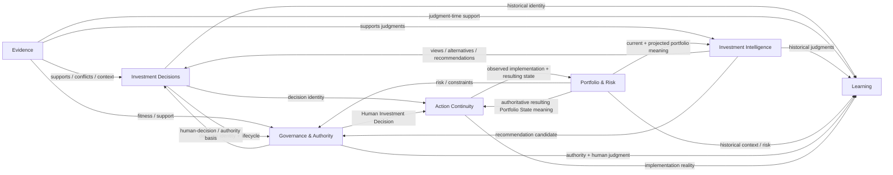
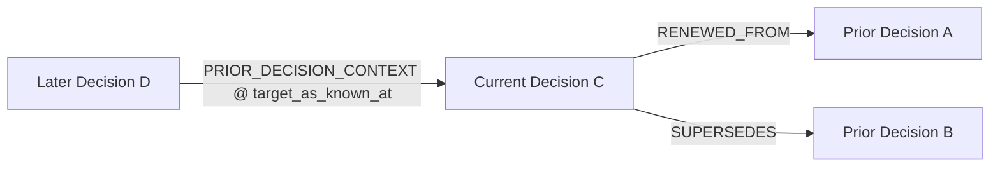
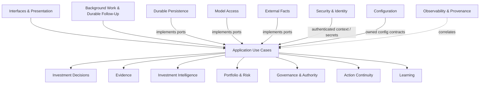
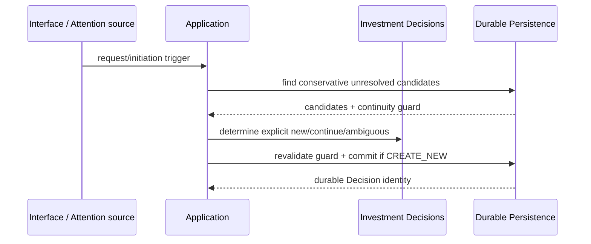
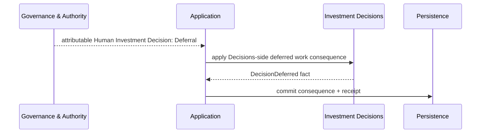
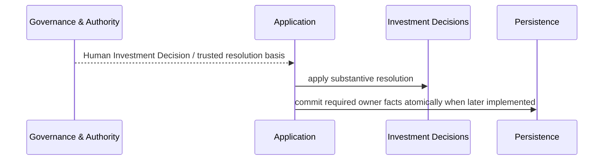
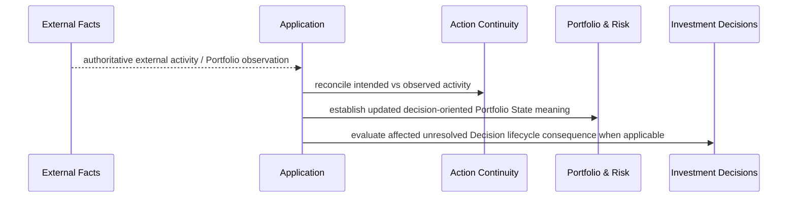

# Polaris Domain Interaction Map

**Status:** Proposed  
**Release:** 0.2.0  
**Purpose:** Define cross-entity relationship, authority-flow, runtime-collaboration, and historical-reference semantics so entity designs and implementation Specs do not invent boundary behavior independently.

## Authority and scope

This document is subordinate to:

- [`../current/platform-architecture-0.2.0.md`](../current/platform-architecture-0.2.0.md);
- [`../product/requirements-0.2.0.md`](../product/requirements-0.2.0.md);
- [`../product/requirements-0.2.0-amendment-r2-edge-cases.md`](../product/requirements-0.2.0-amendment-r2-edge-cases.md);
- [`../product/domain-model.md`](../product/domain-model.md) and [`../../CONTEXT.md`](../../CONTEXT.md);
- accepted ADRs under [`../adr/`](../adr/);
- active entity registry [`../../wiki/index.md`](../../wiki/index.md).

It is cross-cutting design, not a replacement for entity ownership. `legacy/v0_1/` is not a relationship source.

---

# 1. Relationship vocabulary

| Relationship | Meaning |
|---|---|
| **owns** | Entity defines canonical semantics/lifecycle. |
| **references** | Stable identity/fact reference without ownership transfer. |
| **consumes** | Application use case uses another owner's fact/judgment as input. |
| **coordinates** | Application sequences work across owners and owns transaction/idempotency behavior. |
| **observes** | Infrastructure normalizes externally authoritative facts without claiming ownership. |
| **implements** | Infrastructure satisfies inward-owned capability contract. |
| **authorizes** | Governance evaluates/records a power-specific authority act. |
| **presents** | Interface exposes application semantics without alternate business truth. |
| **correlates** | Observability attaches technical provenance without becoming business identity. |
| **qualifies/corrects** | Later attributable fact changes supported interpretation without deleting earlier history. |

Default rule:

> **Domain entities own semantics; Application Use Cases coordinate cross-entity behavior.**

An interaction edge does not itself authorize a static import.

---

# 2. Core domain map



Arrows show collaboration/meaning flow, not ownership transfer.

---

# 3. Investment Decisions boundary relationships

## 3.1 Decisions ↔ Evidence

- Decisions owns Decision Need/identity/lifecycle; Evidence owns provenance, temporal fitness, sufficiency/conflict, and material evidence bindings.
- Evidence changes do not by themselves create a new Decision.
- prior Evidence availability/usage is historically reconstructable without rewriting Decision lifecycle.

## 3.2 Decisions ↔ Investment Intelligence

- Recommendation/View/Alternative identities remain Intelligence-owned.
- zero, one, or many Recommendations may exist under one unresolved Decision.
- Intelligence cannot resolve a Decision merely by generating a Recommendation.

## 3.3 Decisions ↔ Portfolio & Risk

- Decision Scope may be unresolved early; Portfolio applicability must not be fabricated.
- Portfolio State/Risk changes may continue the same unresolved Decision, externally resolve it only when the Decision Need itself disappears, or create another Decision Need through Attention.
- Portfolio/Risk does not own Decision identity.

## 3.4 Decisions ↔ Governance & Authority

- Decisions owns the Decisions-side lifecycle consequence.
- Governance owns Human Investment Decision and power-specific authority facts.
- Deferral is a Human Investment Decision; Decisions records resulting `DEFERRED` work posture only from a trusted basis.
- substantive resolution similarly requires a trusted resolution basis.
- Decisions may not fabricate Human Investment Decision merely to reach a lifecycle disposition.

## 3.5 Decisions ↔ Action Continuity

- Action Continuity references Investment Decision identity and applicable Human Investment Decision.
- Action Intent does not reopen/resolve a Decision retroactively.
- external implementation divergence may cause Attention but cannot rewrite historical Decision judgment.

## 3.6 Decisions ↔ Learning

- Learning references historically faithful Decision Memory.
- Outcome/Evaluation/Lesson never rewrite earlier Decision facts.
- a Lesson may influence later Decision work without creating an unsupported direct Decision-to-Decision relationship.

---

# 4. Other domain relationship contracts

## 4.1 Evidence ↔ Intelligence

- Intelligence consumes Evidence; Information/model input is not automatically Evidence.
- supporting/conflicting Evidence remains inspectable after a preferred judgment.

## 4.2 Evidence ↔ Portfolio & Risk

- external portfolio/market facts may play Evidence roles;
- Portfolio & Risk owns economic interpretation/risk semantics;
- stale Evidence may qualify current support without erasing historical assessments.

## 4.3 Evidence ↔ Governance

- Governance may require Evidence freshness/sufficiency/readiness;
- Evidence strength does not itself grant authority.

## 4.4 Intelligence ↔ Portfolio & Risk

- Portfolio context/risk shapes Recommendation formation before governance;
- Intelligence owns analytical preference; Portfolio & Risk owns economic consequence/risk semantics.

## 4.5 Intelligence ↔ Governance

- Governance evaluates consequential use while preserving Recommendation as separate judgment;
- rejection/override does not mutate the original Recommendation.

## 4.6 Portfolio & Risk ↔ Governance

- Portfolio Risk, Formal Constraint result, Policy result, Admissibility, Approval, Mandate Exception, Residual-Risk Acceptance, and Human Investment Decision remain distinct facts.

## 4.7 Governance ↔ Action Continuity

- Human Investment Decision may establish zero/one/many Action Intents;
- investment authority does not create broker execution authority.

## 4.8 Action Continuity ↔ Portfolio & Risk

This edge is load-bearing and explicit.

- External Facts supplies authoritative activity/Portfolio observations.
- Action Continuity owns intended-vs-observed reconciliation and association support.
- Portfolio & Risk owns decision meaning of authoritative Portfolio State/Positions/Exposure/Allocation/Risk.
- external activity may change Portfolio State while other Decisions remain unresolved.
- the same authoritative Portfolio change may externally resolve one Decision, materially alter another unresolved Decision, and create a new Decision Need through Attention; those meanings are coordinated separately rather than collapsed.
- Action Continuity does not manufacture Portfolio facts; Portfolio & Risk does not manufacture Action Intent causality.

## 4.9 Action Continuity ↔ Learning

- Learning may consume implementation fidelity/divergence;
- reconciliation ambiguity remains explicit and does not become false Outcome causality.

---

# 5. Decision-to-Decision relationship map

The `investment-decisions` entity owns typed relationships among Decision identities; Application coordinates establishment.



Rules:

- `RENEWED_FROM` and `SUPERSEDES` form acyclic supported lifecycle lineage;
- Supersession may target unresolved or resolved Decisions and does not replace historical disposition;
- no one-to-one Supersession cardinality is assumed;
- `PRIOR_DECISION_CONTEXT` is created only by attributable material use, not retrieval;
- contextual binding preserves target historical knowledge cutoff/version boundary;
- context graph may contain temporally coherent cycles;
- graph is logical/query shape, not graph-database mandate.

See [`investment-decisions-decision-relationship-model.md`](investment-decisions-decision-relationship-model.md).

---

# 6. Application boundary map



Application rules:

1. cross-entity commands are application-coordinated;
2. one application command owns the semantic transaction boundary for facts it establishes;
3. application invokes domain behavior and inward-owned ports;
4. interfaces/workers/schedulers use same use cases;
5. application does not call concrete infrastructure;
6. long external/model calls occur outside durable transactions and are revalidated before commit;
7. cross-owner atomicity is introduced only when a real use case requires it;
8. continuation/same-vs-new Decision ambiguity fails closed rather than creating duplicate identity.

---

# 7. Infrastructure contracts

## Durable Persistence

- implements semantic storage/query guarantees;
- preserves direct business truth, immutable facts/corrections, dual temporal reconstruction, concurrency/idempotency/continuity arbitration;
- PostgreSQL remains initial adapter only.

## Model Access

- returns draft analytical results + technical provenance;
- cannot persist authority/business truth directly.

## External Facts

- observes/normalizes externally authoritative Evidence, Portfolio State, and execution activity;
- preserves source/as-of/observation identity/authority.

## Background Work & Durable Follow-Up

- invokes normal application use cases;
- technical work identity never becomes Decision identity;
- mechanism may be outbox/queue/broker/event bus/CDC if guarantees hold.

## Observability & Technical Provenance

- correlates requests, work, model/source calls, timings/failures;
- never substitutes for Actor Attribution or canonical business provenance.

## Security & Identity

- authenticates actor/access context;
- authentication remains distinct from application authorization and investment authority.

## Configuration

- supplies product/domain-facing config contracts and isolates provider/runtime settings.

## Interfaces & Presentation

- thin adapters over shared application commands/queries;
- no UI/report-specific business truth.

---

# 8. Authority flow

```text
external factual authority
        ↓ observations
Evidence / Portfolio meaning
        ↓ support
Polaris analytical judgment
        ↓ recommendation candidate
rules + Investment Authority Regime
        ↓
Human authority acts / Human Investment Decision
        ↓
Action Intent where applicable
        ↓
authoritative external operational reality
```

Authority is non-transitive:

- Evidence does not grant authority;
- Risk does not grant/deny authority by itself;
- Recommendation is not Human Investment Decision;
- Human Investment Decision is not broker execution authority;
- authentication is not investment authority.

---

# 9. Actor Attribution vs provenance flow

```text
trigger/request/observation
        ↓
Application work
        ↓
domain act
        ├── Actor Attribution: who formed/performed it
        └── provenance: what technical/external path contributed
```

Examples:

- human request may trigger Polaris-attributed Decision Need determination;
- human may directly establish attributable Decision Need;
- model/provider/workflow IDs remain provenance, not actors.

---

# 10. Business truth / Decision Memory

Durable Decision Memory composes owner-specific facts:

```text
Decisions ─┐
Evidence   ─┤
Intelligence─┤
Portfolio/Risk─┤
Governance ─┤──> Decision Memory Query
Continuity ─┤
Learning   ─┘
```

Cross-entity projections may denormalize for reads but cannot become sole authority.

---

# 11. Key interaction sequences

## 11.1 New Decision with continuity check



Ambiguity creates no automatic duplicate Decision.

## 11.2 Deferral



R2 may test with trusted fixture but must not fabricate Governance fact.

## 11.3 Substantive resolution



## 11.4 Late lifecycle correction

```mermaid
sequenceDiagram
    participant X as External Facts
    participant App as Application
    participant D as Investment Decisions
    participant P as Persistence

    Note over P: Earlier DecisionResolved already recorded
    X-->>App: late authoritative fact, effective before prior resolution
    App->>D: qualify/correct supported lifecycle interpretation
    D-->>App: DecisionLifecycleCorrected
    App->>P: append correction; preserve old fact
```

Earlier `as_known_at` history remains stable.

## 11.5 Action continuity changes portfolio context



One observation may affect several Decisions differently; no implicit causal collapse occurs.

---

# 12. Static dependency expectations

Compatible with:

```text
interfaces -> application -> domain
infrastructure -> inward contracts
```

Within domain:

- packages may share only deliberately earned stable types;
- no entity imports another entity's application orchestration/infrastructure;
- cross-entity sequencing belongs to Application;
- no shared-domain utility package merely to bypass ownership.

---

# 13. R2 design consequence

R2 primarily exercises:

- `investment-decisions`;
- `application-use-cases`;
- `durable-persistence`.

The complete R2 pre-Spec design set is:

- [`platform-domain-interaction-map.md`](platform-domain-interaction-map.md);
- [`investment-decisions-lifecycle-model.md`](investment-decisions-lifecycle-model.md);
- [`investment-decisions-decision-relationship-model.md`](investment-decisions-decision-relationship-model.md);
- [`application-use-cases-investment-decision-lifecycle.md`](application-use-cases-investment-decision-lifecycle.md);
- [`durable-persistence-investment-decision-history.md`](durable-persistence-investment-decision-history.md).

The approved component-boundary plan remains milestone integration authority.

---

# 14. Approval / Spec-readiness gate

Before this map becomes design authority for Specs, review must confirm:

1. every active entity has a clear role;
2. no edge transfers ownership accidentally;
3. Decisions/Governance Deferral and resolution seams are explicit;
4. Supersession is orthogonal to historical resolution;
5. Action Continuity ↔ Portfolio & Risk is explicit;
6. Actor Attribution and technical provenance do not collapse;
7. Decision relationship graph semantics preserve hindsight-safe historical context;
8. no legacy topology is reintroduced;
9. no unresolved architecture choice requires an ADR/Wayfinder.
