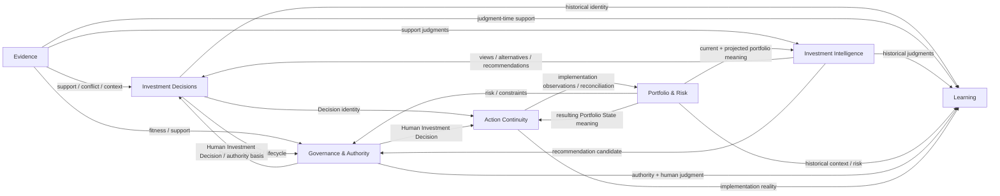
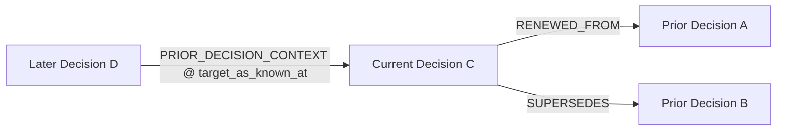
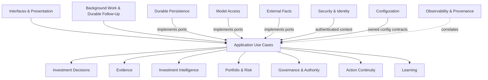
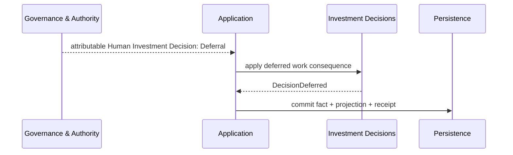
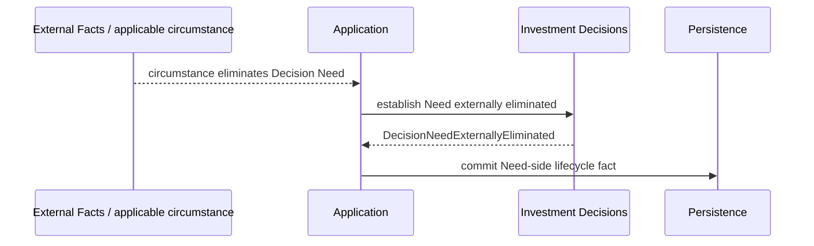
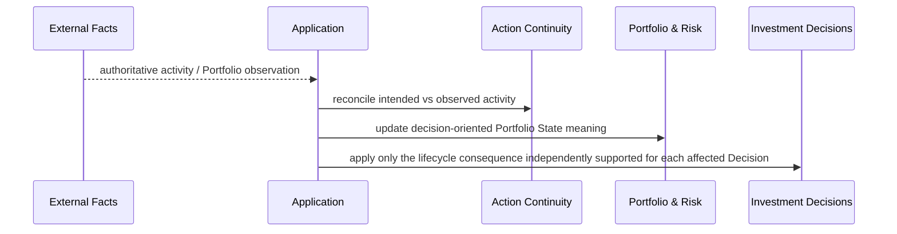

# Polaris Domain Interaction Map

**Status:** Proposed  
**Release:** 0.2.0  
**Purpose:** Define cross-entity ownership, collaboration, authority-flow, runtime-coordination, and historical-reference semantics so entity designs and implementation Specs do not invent boundary behavior independently.

## Authority and scope

This document is subordinate to:

- [`../current/platform-architecture-0.2.0.md`](../current/platform-architecture-0.2.0.md);
- [`../product/requirements-0.2.0.md`](../product/requirements-0.2.0.md);
- proposed audit reconciliation [`../product/requirements-0.2.0-amendment-r2-edge-cases.md`](../product/requirements-0.2.0-amendment-r2-edge-cases.md);
- [`../product/domain-model.md`](../product/domain-model.md) and [`../../CONTEXT.md`](../../CONTEXT.md);
- accepted ADRs under [`../adr/`](../adr/);
- active entity registry [`../../wiki/index.md`](../../wiki/index.md).

It is cross-cutting design, not a replacement for entity ownership. `legacy/v0_1/` is not a relationship source.

---

# 1. Relationship vocabulary

| Relationship | Meaning |
|---|---|
| **owns** | Entity defines canonical semantics/lifecycle of the concept. |
| **references** | Stable identity/fact reference without ownership transfer. |
| **consumes** | Application use case obtains another owner's fact/judgment as input. |
| **coordinates** | Application sequences work across owners and owns transaction/idempotency/concurrency behavior. |
| **observes** | Infrastructure normalizes externally authoritative facts without claiming ownership. |
| **implements** | Infrastructure satisfies an inward-owned capability contract. |
| **authorizes** | Governance evaluates/records a power-specific authority act. |
| **presents** | Interface exposes application semantics without alternate business truth. |
| **correlates** | Observability attaches technical provenance without becoming business identity. |
| **qualifies/corrects** | Later attributable fact changes supported interpretation without deleting earlier history. |

Default rule:

> **Domain entities own semantics; Application Use Cases coordinate cross-entity behavior.**

A collaboration edge does not itself authorize a static import.

---

# 2. Core domain map



Arrows show collaboration/meaning flow, not ownership transfer.

---

# 3. Investment Decisions cross-domain contracts

## 3.1 Decisions ↔ Evidence

- Decisions owns Decision Need, identity, and lifecycle semantics; Evidence owns evidentiary role/provenance/fitness/bindings.
- changed Evidence does not by itself create a new Decision.
- historical Evidence availability/use must remain reconstructable without rewriting Decision history.

## 3.2 Decisions ↔ Investment Intelligence

- Intelligence owns Views, Alternatives, Recommendations, Proposed Actions, and related judgment semantics.
- a changed Recommendation does not change Decision identity while the coherent unresolved choice remains the same.
- Intelligence cannot resolve a Decision merely by generating a Recommendation.

## 3.3 Decisions ↔ Portfolio & Risk

- Decision Scope may be unknown or partially known during initiation; Portfolio applicability must not be fabricated.
- Portfolio State/Risk changes may alter the same unresolved Decision, eliminate its Decision Need, or contribute to another Decision Need through Attention.
- **External Resolution is a Decisions-owned conclusion that the Decision Need was externally eliminated; it is not a substantive judgment supplied by Portfolio & Risk.**
- Portfolio & Risk owns Portfolio meaning, not Decision identity.

## 3.4 Decisions ↔ Governance & Authority

The seam is intentionally asymmetric:

- Governance owns Human Investment Decision and power-specific authority acts.
- Decisions owns the Decision-side consequence of a trusted human judgment.
- Human Deferral may set Decisions work posture to `DEFERRED` while Need remains active and judgment unresolved.
- a substantive Human Investment Decision may establish Decisions-side substantive judgment resolution.
- Decisions must not manufacture a Human Investment Decision or authority fact to obtain a convenient lifecycle state.
- a Human Investment Decision that actually occurred remains historical even if later facts change the supported understanding of the Decision Need.

## 3.5 Decisions ↔ Action Continuity

- Action Continuity references Decision identity and Human Investment Decision where applicable.
- Action Intent does not retroactively create or resolve the Decision.
- implementation divergence may trigger later Attention but cannot rewrite historical Decision judgment.

## 3.6 Decisions ↔ Learning

- Learning consumes historically faithful Decision Memory.
- Outcome/Evaluation/Lesson do not rewrite earlier Decision facts.
- Lesson-mediated influence remains distinct from direct prior-Decision-context use.

---

# 4. Other domain contracts

## Evidence ↔ Investment Intelligence

Information/model input is not automatically Evidence. Supporting and Conflicting Evidence remain inspectable after preferred judgment.

## Evidence ↔ Portfolio & Risk

Externally authoritative facts may play Evidence roles while Portfolio & Risk owns the economic interpretation/Risk semantics. Staleness may qualify current support without erasing history.

## Evidence ↔ Governance

Governance may consume Evidence readiness/freshness/sufficiency, but Evidence does not grant authority.

## Investment Intelligence ↔ Portfolio & Risk

Portfolio context/Risk shapes Recommendation formation. Intelligence owns analytical preference; Portfolio & Risk owns economic consequence/Risk semantics.

## Investment Intelligence ↔ Governance

Governance may evaluate a Recommendation for consequential use without mutating the Recommendation judgment.

## Portfolio & Risk ↔ Governance

Portfolio Risk, Formal Constraint result, Policy result, Admissibility, Approval, Mandate Exception, Residual-Risk Acceptance, and Human Investment Decision remain distinct.

## Governance ↔ Action Continuity

A Human Investment Decision may establish zero/one/many Action Intents. Investment authority does not imply broker execution authority.

## Action Continuity ↔ Portfolio & Risk

This seam is load-bearing:

- External Facts supplies authoritative activity/Portfolio observations;
- Action Continuity owns intended-vs-observed association and reconciliation support;
- Portfolio & Risk owns the decision meaning of resulting Portfolio State/Positions/Exposure/Allocation/Risk;
- the same authoritative change may externally eliminate one Decision Need, materially change another unresolved Decision, and create a new Decision Need;
- those meanings are application-coordinated independently rather than inferred from one another;
- Action Continuity does not manufacture Portfolio facts, and Portfolio & Risk does not manufacture Action Intent causality.

## Action Continuity ↔ Learning

Learning may consume implementation fidelity/divergence. Ambiguous reconciliation stays ambiguous rather than becoming false Outcome attribution.

---

# 5. Decision-to-Decision graph

`investment-decisions` owns the semantics of typed Decision relationships; Application coordinates their establishment.



Rules:

- `RENEWED_FROM` means new judgment after prior substantive resolution or external elimination of the prior Decision Need;
- `SUPERSEDES` affects continuing applicability/operative basis and may target unresolved or resolved Decisions without rewriting lifecycle axes;
- supported `RENEWED_FROM` + `SUPERSEDES` lineage is acyclic;
- no one-to-one Supersession cardinality is assumed;
- `PRIOR_DECISION_CONTEXT` requires attributable material use, not retrieval;
- contextual binding preserves target historical state through `target_as_known_at` or equivalent;
- contextual graph may contain temporally coherent cycles;
- graph semantics do not require graph storage.

See [`investment-decisions-decision-relationship-model.md`](investment-decisions-decision-relationship-model.md).

---

# 6. Application boundary



Application rules:

1. cross-entity behavior is application-coordinated;
2. application command owns the semantic transaction boundary for facts it establishes;
3. application invokes domain behavior through inward-owned contracts;
4. interfaces/workers/schedulers share the same use cases;
5. application does not call concrete infrastructure;
6. long model/external calls occur outside durable transactions and are revalidated before commit;
7. cross-owner atomicity appears only when an actual use case earns it;
8. same-vs-new Decision ambiguity fails closed rather than manufacturing duplicate identity.

---

# 7. Infrastructure contracts

## Durable Persistence

Implements direct business persistence, immutable facts/corrections, dual temporal reconstruction, expected-version concurrency, idempotency, and continuity-safe initiation. PostgreSQL remains an adapter.

## Model Access

Returns draft analytical results and technical provenance; it cannot directly persist authority/business truth.

## External Facts

Observes/normalizes externally authoritative Evidence, Portfolio State, and execution activity while preserving source/as-of/observation authority.

## Background Work & Durable Follow-Up

Invokes ordinary application use cases. Technical work identity never becomes Decision identity.

## Observability & Technical Provenance

Correlates requests/work/model/source calls without becoming Actor Attribution or required business provenance.

## Security & Identity

Establishes authenticated actor/access context while remaining distinct from investment authority.

## Configuration

Supplies domain-facing configuration and isolates provider/runtime settings.

## Interfaces & Presentation

Thin adapters over shared application semantics; no UI/report-specific business truth.

---

# 8. Actor Attribution and provenance flow

```text
trigger / source observation / request
        ↓
Application coordination
        ↓
domain act
        ├── Actor Attribution: who formed/performed the act
        ├── source/trigger provenance: why work occurred
        └── technical provenance: which model/provider/tool/work contributed
```

A human request may trigger a Polaris-attributed Decision Need determination. A model/provider/workflow is not an actor merely because it participated technically.

---

# 9. Key interaction sequences

## New Decision / continuity

```mermaid
sequenceDiagram
    participant S as Interface / Attention Source
    participant App as Application
    participant P as Durable Persistence
    participant D as Investment Decisions

    S->>App: request / candidate Decision Need
    App->>P: all unresolved non-superseded Decisions + guard
    P-->>App: candidates + continuity observation
    App->>D: explicit CONTINUE / CREATE_NEW / AMBIGUOUS determination
    App->>P: atomically revalidate guard; commit only if still valid
    P-->>App: committed Decision identity or continuity conflict
```

## Deferral



## External Resolution



No Human Investment Decision is implied.

## Late lifecycle correction

```mermaid
sequenceDiagram
    participant X as External Facts
    participant App as Application
    participant D as Investment Decisions
    participant P as Persistence

    Note over P: earlier human/resolution history already recorded
    X-->>App: late fact effective before prior lifecycle interpretation
    App->>D: qualify supported Need/judgment interpretation
    D-->>App: DecisionLifecycleCorrected
    App->>P: append correction; preserve old facts
```

## Action continuity changes Portfolio context



---

# 10. Static dependency expectations

```text
interfaces -> application -> domain
infrastructure -> inward contracts
```

Cross-entity sequencing belongs to Application. No shared-domain utility package may be introduced merely to bypass ownership.

---

# 11. R2 design set

R2 primarily exercises `investment-decisions`, `application-use-cases`, and `durable-persistence`.

The complete pre-Spec design set is:

1. [`platform-domain-interaction-map.md`](platform-domain-interaction-map.md)
2. [`investment-decisions-lifecycle-model.md`](investment-decisions-lifecycle-model.md)
3. [`investment-decisions-decision-relationship-model.md`](investment-decisions-decision-relationship-model.md)
4. [`application-use-cases-investment-decision-lifecycle.md`](application-use-cases-investment-decision-lifecycle.md)
5. [`durable-persistence-investment-decision-history.md`](durable-persistence-investment-decision-history.md)

The approved component-boundary plan remains the milestone integration source.

---

# 12. Approval / Spec-readiness gate

Before this map is approved for Specs, review must confirm:

1. ownership remains clear and non-transitive;
2. External Resolution is correctly represented as Decision Need elimination rather than substantive judgment;
3. Governance/Decisions Deferral and resolution seams remain explicit;
4. Supersession is orthogonal to lifecycle axes and cardinality-neutral;
5. Action Continuity ↔ Portfolio & Risk is explicit;
6. Actor Attribution and provenance remain separate;
7. contextual Decision relationships are hindsight-safe;
8. no legacy topology is reintroduced;
9. no unresolved architecture decision requires an ADR or Wayfinder.
