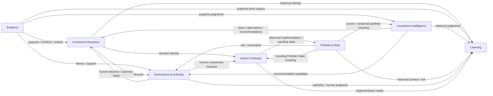
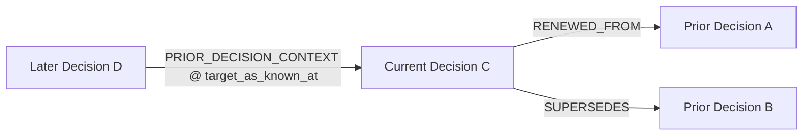
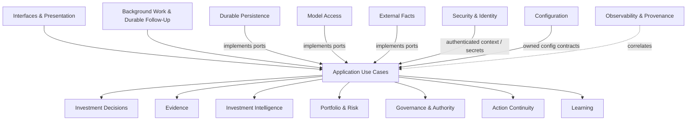
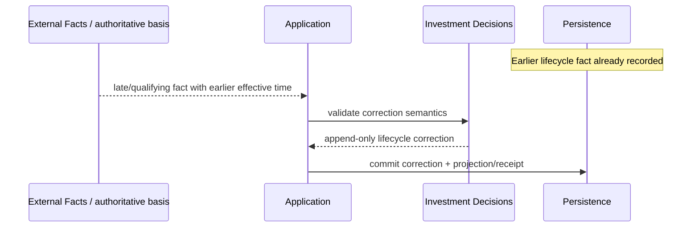
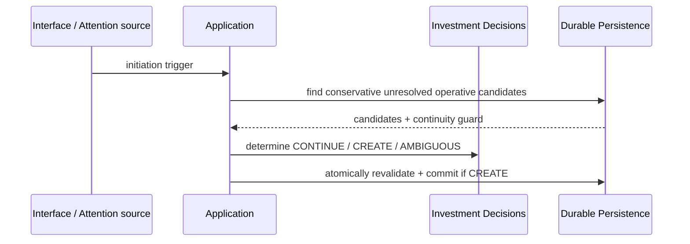
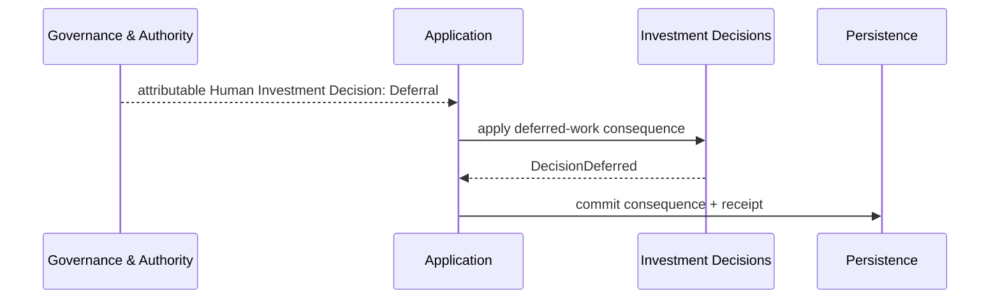
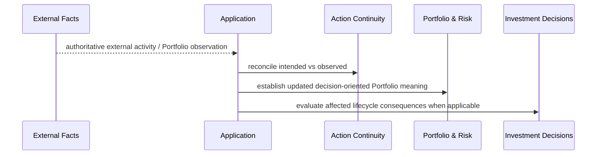

# Polaris Domain Interaction Map

**Status:** Proposed  
**Release:** 0.2.0  
**Purpose:** Define cross-entity relationship, authority-flow, runtime-collaboration, and historical-reference semantics so entity designs and implementation Specs do not invent boundary behavior independently.

## Authority and scope

This document is subordinate to:

- [`../current/platform-architecture-0.2.0.md`](../current/platform-architecture-0.2.0.md);
- [`../product/requirements-0.2.0.md`](../product/requirements-0.2.0.md);
- proposed [`../product/requirements-0.2.0-amendment-r2-edge-cases.md`](../product/requirements-0.2.0-amendment-r2-edge-cases.md);
- [`../product/domain-model.md`](../product/domain-model.md) and [`../../CONTEXT.md`](../../CONTEXT.md);
- accepted ADRs under [`../adr/`](../adr/);
- active entity registry [`../../wiki/index.md`](../../wiki/index.md).

It is cross-cutting design, not a replacement for entity ownership. `legacy/v0_1/` is not a relationship source.

---

# 1. Relationship vocabulary

| Relationship | Meaning |
|---|---|
| **owns** | Entity defines canonical semantics/lifecycle. |
| **references** | Stable identity/fact reference without ownership transfer. |
| **consumes** | Application use case uses another owner's fact/judgment as input. |
| **coordinates** | Application sequences work across owners and owns transaction/idempotency behavior. |
| **observes** | Infrastructure normalizes externally authoritative facts without claiming ownership. |
| **implements** | Infrastructure satisfies inward-owned capability contract. |
| **authorizes** | Governance evaluates/records a power-specific authority act. |
| **presents** | Interface exposes application semantics without alternate business truth. |
| **correlates** | Observability attaches technical provenance without becoming business identity. |
| **qualifies/corrects** | Later attributable fact changes supported interpretation without deleting earlier history. |

Default rule:

> **Domain entities own semantics; Application Use Cases coordinate cross-entity behavior.**

An interaction edge does not itself authorize a static import.

---

# 2. Core domain map



Arrows show collaboration/meaning flow, not ownership transfer.

---

# 3. Investment Decisions relationships

## 3.1 Decisions ↔ Evidence

- Decisions owns Need/identity/lifecycle; Evidence owns provenance, temporal fitness, sufficiency/conflict, and material evidence bindings.
- Evidence change alone never changes Decision identity.
- Late Evidence may qualify a supported lifecycle interpretation through an explicit correction path; it never rewrites earlier facts silently.

## 3.2 Decisions ↔ Investment Intelligence

- Views/Alternatives/Recommendations remain Intelligence-owned.
- Recommendation does not resolve a Decision by itself.
- zero/one/many Recommendations may exist through one unresolved Decision.

## 3.3 Decisions ↔ Portfolio & Risk

- Decision Scope may be unresolved/partial during initiation.
- Portfolio State/Risk change can alter context, externally eliminate a Need only when the choice actually disappears, or create another Need through Attention.
- Portfolio & Risk does not own Decision identity.

## 3.4 Decisions ↔ Governance & Authority

- Governance owns Human Investment Decision and power-specific authority facts.
- Decisions owns the resulting lifecycle/work consequence.
- Deferral is Governance-owned human judgment; Decisions records `DEFERRED` only from trusted basis.
- substantive resolution similarly consumes a trusted basis.
- Decisions cannot fabricate human authority to reach a lifecycle state.

## 3.5 Decisions ↔ Action Continuity

- Action Continuity references Decision identity + applicable Human Investment Decision.
- Action Intent does not retroactively resolve/reopen a Decision.
- observed implementation divergence may cause Attention but does not rewrite historical judgment.

## 3.6 Decisions ↔ Learning

- Learning consumes historically faithful Decision Memory.
- Outcome/Evaluation/Lesson never rewrite earlier Decision facts.
- Lesson-mediated influence stays explicit rather than automatically becoming a direct prior-Decision edge.

---

# 4. Other domain contracts

## 4.1 Evidence ↔ Intelligence

- Intelligence consumes Evidence;
- information/model input is not automatically Evidence;
- conflicting Evidence remains inspectable after judgment.

## 4.2 Evidence ↔ Portfolio & Risk

- external portfolio/market facts may play Evidence roles;
- Portfolio & Risk owns economic interpretation/risk semantics;
- stale Evidence may qualify support without erasing historical assessments.

## 4.3 Evidence ↔ Governance

- Governance may require Evidence readiness/freshness/sufficiency;
- Evidence strength does not itself grant authority.

## 4.4 Intelligence ↔ Portfolio & Risk

- Portfolio context/risk shapes Recommendations;
- Intelligence owns analytical preference;
- Portfolio & Risk owns economic consequence/risk semantics.

## 4.5 Intelligence ↔ Governance

- Governance evaluates consequential use while preserving Recommendation as separate judgment;
- rejection/override does not mutate Recommendation.

## 4.6 Portfolio & Risk ↔ Governance

Portfolio Risk, Formal Constraint result, Policy result, Admissibility, Approval, Mandate Exception, Residual-Risk Acceptance, and Human Investment Decision remain distinct.

## 4.7 Governance ↔ Action Continuity

- Human Investment Decision may establish zero/one/many Action Intents;
- investment authority does not create broker execution authority.

## 4.8 Action Continuity ↔ Portfolio & Risk

This edge is explicit and load-bearing.

- External Facts supplies authoritative activity/Portfolio observations.
- Action Continuity owns intended-vs-observed reconciliation/association support.
- Portfolio & Risk owns decision meaning of resulting Portfolio State/Positions/Exposure/Allocation/Risk.
- same authoritative Portfolio change may externally resolve one Decision, materially alter another unresolved Decision, and create a third Decision Need through Attention.
- meanings are coordinated separately; Action Continuity does not manufacture Portfolio facts and Portfolio & Risk does not manufacture Action Intent causality.

## 4.9 Action Continuity ↔ Learning

Learning may consume implementation fidelity/divergence; reconciliation ambiguity remains explicit and does not become false Outcome causality.

---

# 5. Decision-to-Decision graph

`investment-decisions` owns typed relationships; Application coordinates establishment.



Rules:

- `RENEWED_FROM` + `SUPERSEDES` supported lineage is acyclic;
- Supersession is orthogonal to lifecycle disposition and may target unresolved/resolved Decisions;
- no one-to-one Supersession cardinality assumption;
- `PRIOR_DECISION_CONTEXT` requires attributable material use, not retrieval;
- context edge binds target historical knowledge/version boundary;
- context graph may have temporally coherent cycles;
- graph is semantic/query shape, not graph-database mandate.

---

# 6. Application boundary map



Application rules:

1. cross-entity commands are application-coordinated;
2. one use case owns semantic transaction boundary for facts it establishes;
3. interfaces/workers/schedulers call the same application boundary;
4. application depends on inward contracts, not concrete infrastructure;
5. long external/model calls stay outside durable-store transactions and are revalidated before commit;
6. continuity ambiguity fails closed rather than creating duplicate Decision identity;
7. corrections are append-only and preserve prior as-known-at history.

---

# 7. Infrastructure relationships

## Durable Persistence

Implements direct durable business truth, immutable facts/corrections, dual temporal reconstruction, idempotency/concurrency/continuity arbitration, and correction-aware relationship traversal.

## Model Access

Returns draft analytical results + technical provenance; cannot persist authority/business truth directly.

## External Facts

Observes/normalizes externally authoritative Evidence, Portfolio State, and execution activity while preserving source/as-of/authority.

## Background Work & Durable Follow-Up

Invokes application use cases; technical work ID never becomes Decision ID. Outbox/queue/broker/event bus/CDC remain adapter choices if guarantees hold.

## Observability & Technical Provenance

Correlates requests/work/model/source calls; never substitutes for Actor Attribution or canonical business facts.

## Security & Identity

Authenticates actor/access context; authentication remains separate from application authorization and Investment Authority Regime.

## Configuration

Supplies product/domain-facing config contracts and isolates provider/runtime settings.

## Interfaces & Presentation

Thin adapters over shared application commands/queries; no UI/report-specific business truth.

---

# 8. Authority flow

```text
external factual authority
        ↓ observations
Evidence / Portfolio meaning
        ↓ support
Polaris analytical judgment
        ↓ Recommendation candidate
rules + Investment Authority Regime
        ↓
Human authority acts / Human Investment Decision
        ↓
Action Intent where applicable
        ↓
authoritative external operational reality
```

Authority is non-transitive.

---

# 9. Actor Attribution vs provenance

```text
trigger/request/observation
        ↓
Application work
        ↓
domain act
        ├── Actor Attribution: who formed/performed it
        └── provenance: what technical/external path contributed
```

Examples:

- human request may trigger Polaris-attributed Decision Need determination;
- human may directly establish a Decision Need;
- model/provider/workflow IDs remain provenance, not actors.

---

# 10. Lifecycle correction flow



If currently available facts leave incompatible interpretations, Decision Memory exposes contested/indeterminate interpretation rather than newest-wins.

---

# 11. R2 interaction sequences

## New Decision



## Deferral



## Substantive resolution

```mermaid
sequenceDiagram
    participant G as Governance & Authority
    participant App as Application
    participant D as Investment Decisions
    participant P as Persistence

    G-->>App: trusted Human Investment Decision / resolution basis
    App->>D: apply SUBSTANTIVELY_RESOLVED consequence
    App->>P: commit Decisions fact; later cross-owner UoW when Governance is implemented
```

## Action continuity changes portfolio context



---

# 12. Static dependency expectations

```text
interfaces -> application -> domain
infrastructure -> inward contracts
```

Within domain:

- no entity imports another entity's application orchestration/infrastructure;
- cross-entity sequencing belongs to Application;
- shared types are earned deliberately, not created to bypass ownership.

---

# 13. R2 design set

The complete pre-Spec design set is:

- [`platform-domain-interaction-map.md`](platform-domain-interaction-map.md);
- [`investment-decisions-lifecycle-model.md`](investment-decisions-lifecycle-model.md);
- [`investment-decisions-decision-relationship-model.md`](investment-decisions-decision-relationship-model.md);
- [`application-use-cases-investment-decision-lifecycle.md`](application-use-cases-investment-decision-lifecycle.md);
- [`durable-persistence-investment-decision-history.md`](durable-persistence-investment-decision-history.md).

The approved component-boundary plan remains R2 integration authority.

---

# 14. Spec-readiness gate

Before Specs, review must confirm:

1. entity ownership remains clear;
2. no edge transfers authority/ownership accidentally;
3. Deferral/substantive-resolution seams preserve Governance ownership;
4. lifecycle disposition/work posture/Supersession remain distinct;
5. Action Continuity ↔ Portfolio & Risk is explicit;
6. Actor Attribution != technical provenance;
7. Decision relationship context is hindsight-safe;
8. continuity ambiguity fails closed;
9. correction/contested lifecycle semantics are explicit;
10. no legacy topology is reintroduced.
