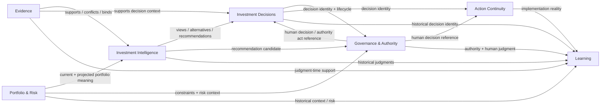
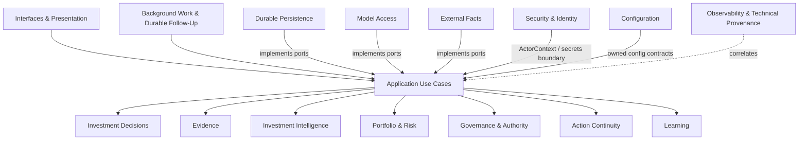
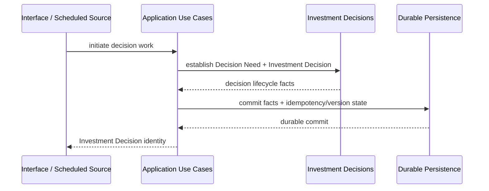
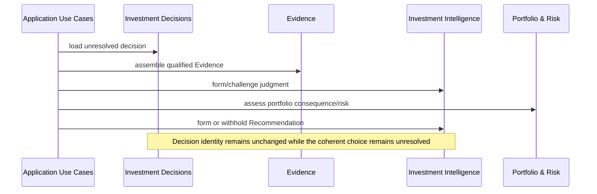
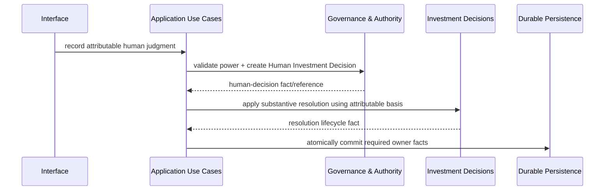
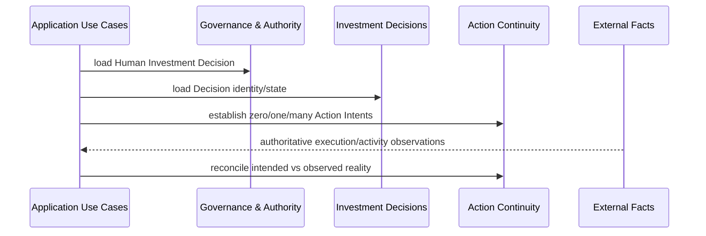
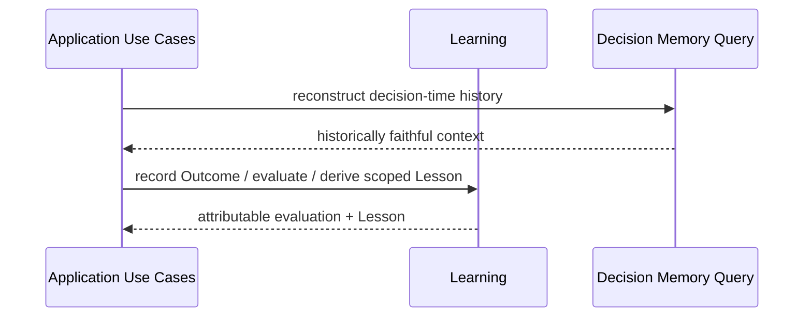

# Polaris Domain Interaction Map

**Status:** Proposed  
**Release:** 0.2.0  
**Purpose:** Define the cross-entity relationship model for the greenfield Polaris architecture so later entity designs and implementation Specs do not invent boundary semantics independently.

## Authority and scope

This document is subordinate to:

- [`../current/platform-architecture-0.2.0.md`](../current/platform-architecture-0.2.0.md);
- [`../product/requirements-0.2.0.md`](../product/requirements-0.2.0.md);
- [`../product/domain-model.md`](../product/domain-model.md) and [`../../CONTEXT.md`](../../CONTEXT.md);
- accepted ADRs under [`../adr/`](../adr/);
- the active entity registry at [`../../wiki/index.md`](../../wiki/index.md).

It is a cross-cutting design artifact, not a replacement for entity ownership. Each entity remains authoritative only for the semantics assigned to it by the approved architecture. The map defines how those owners collaborate without collapsing their boundaries.

`legacy/v0_1/` is not a relationship source for this map.

---

# 1. Relationship vocabulary

The map uses these relationship types deliberately:

| Relationship | Meaning |
|---|---|
| **owns** | The entity defines the canonical semantics and lifecycle of the concept. |
| **references** | One entity may retain a stable reference to another entity-owned fact without taking ownership of it. |
| **consumes** | An application use case obtains another entity's fact or judgment as an input. Consumption does not transfer ownership. |
| **coordinates** | The Application Use Cases boundary sequences work across owners and establishes transaction/idempotency behavior. |
| **observes** | Infrastructure normalizes externally authoritative facts without claiming business ownership of those facts. |
| **implements** | Infrastructure satisfies an inward-owned application/domain capability contract. |
| **authorizes** | Governance determines whether a power-specific act is permitted or records that act. Authorization does not transfer ownership of the governed concept. |
| **presents** | Interfaces expose application commands/queries without reconstructing alternate business truth. |
| **correlates** | Observability attaches technical provenance/correlation without becoming business identity. |

The default cross-domain rule is:

> **Domain entities own semantics; Application Use Cases coordinate cross-entity behavior.**

A domain entity may reference stable IDs/value semantics owned by another domain entity, but cross-entity business workflows should not be implemented as one domain module calling another module's application/service implementation directly.

---

# 2. Core domain map



The arrows show collaboration, not ownership transfer and not required static imports.

---

# 3. Domain relationship contracts

## 3.1 Investment Decisions ↔ Evidence

**Investment Decisions owns:** Decision Need, Investment Decision identity, lifecycle continuity, Deferral, resolution state, External Resolution, Supersession, and renewed-decision linkage.

**Evidence owns:** Evidence identity, provenance, temporal availability, freshness/sufficiency state, conflict/missing state, and bindings showing which Evidence supported a material judgment.

Relationship rules:

- an Investment Decision may reference Evidence and Decision Context without embedding Evidence ownership;
- changing the Evidence set does not by itself create a new Investment Decision;
- Evidence may be associated with one or more decisions/judgments, but Evidence identity never becomes Decision identity;
- historical Decision Memory must be able to show which Evidence was available/used at the relevant time without rewriting the earlier decision lifecycle.

## 3.2 Investment Decisions ↔ Investment Intelligence

**Investment Intelligence owns:** Investment Hypotheses, Views, uncertainty, alternatives, materially used Signals, Recommendations, and Proposed Actions.

Relationship rules:

- every Recommendation is bound to an Investment Decision, but remains separately identified;
- zero, one, or multiple Recommendations may exist during one unresolved Investment Decision;
- a changed Recommendation does not create a new Investment Decision while the coherent unresolved choice is unchanged;
- Decisions does not absorb Recommendation content into its lifecycle state;
- Intelligence does not resolve an Investment Decision by generating a Recommendation.

## 3.3 Investment Decisions ↔ Portfolio & Risk

**Portfolio & Risk owns:** Portfolio identity, decision-oriented Portfolio State meaning, projected state/consequence, Portfolio Risk, Portfolio Risk Assessment, mandate semantics, and deterministic Formal Constraint evaluation where applicable.

Relationship rules:

- Investment Decision identity is independent of mutable Portfolio State;
- Portfolio State/Risk changes may cause new work on the same unresolved decision;
- Portfolio/Risk may provide inputs that materially alter Recommendation formation without gaining decision-lifecycle ownership;
- authoritative operational Portfolio facts retain external-source authority even when Portfolio & Risk gives them decision meaning inside Polaris.

## 3.4 Investment Decisions ↔ Governance & Authority

This relationship is intentionally split because the entities own different halves of resolution semantics.

**Investment Decisions owns:** whether the Decision is unresolved, deferred, resolved, externally resolved, or superseded.

**Governance & Authority owns:** Human Investment Decision and other power-specific authority acts.

Relationship rules:

- a Human Investment Decision is a separate durable fact that may substantively resolve an Investment Decision;
- recording the Human Investment Decision must not mutate or erase prior Recommendations;
- Decisions may record that substantive resolution occurred only through an attributable resolution basis supplied by the application coordination path;
- the Decisions entity must not manufacture a Human Investment Decision merely to reach a terminal lifecycle state;
- Governance may refer to an Investment Decision and Recommendation, but cannot replace their identities;
- a Human Investment Decision may exist even when no Investment Recommendation was supportable.

## 3.5 Investment Decisions ↔ Action Continuity

**Action Continuity owns:** Action Intent and reconciliation with authoritative external activity.

Relationship rules:

- Action Intent is downstream of an attributable Human Investment Decision and references the applicable Investment Decision;
- Deferral, hold, or no-action resolution may produce zero Action Intents;
- external activity does not retroactively manufacture an Investment Decision or Action Intent;
- Action Continuity cannot reopen a resolved Investment Decision merely because implementation diverged.

## 3.6 Investment Decisions ↔ Learning

**Learning owns:** Outcome, Decision Evaluation, Lesson, retrospective criteria, and evaluation judgment.

Relationship rules:

- Learning references the historical Investment Decision and its material decision-time context;
- Outcome does not determine whether the earlier decision process was sound;
- later Evaluation/Lesson facts never rewrite what the earlier Decision, Evidence, Recommendation, Risk, authority, or Action Intent actually was;
- Lessons may influence future Attention/Decision Need formation but do not become Policy, Formal Constraints, Mandates, or authority merely by being learned.

## 3.7 Evidence ↔ Investment Intelligence

- Intelligence consumes attributable Evidence through application coordination;
- Information is not automatically Evidence merely because a model or analytical component received it;
- supporting and Conflicting Evidence remain inspectable after a preferred View/Recommendation is formed;
- model output cannot self-declare Evidence provenance or authority.

## 3.8 Evidence ↔ Portfolio & Risk

- external portfolio/market facts may become Evidence for an attributable judgment;
- Portfolio & Risk owns portfolio interpretation and risk semantics, while Evidence owns the preserved support/provenance relationship;
- stale or missing Evidence may weaken current Portfolio Risk support without erasing historical assessments.

## 3.9 Evidence ↔ Governance & Authority

- Governance consumes Evidence sufficiency/freshness and other support facts where a consequential authority decision requires them;
- Evidence does not grant authority;
- authority acts preserve the Evidence/version context on which they relied where materially required.

## 3.10 Investment Intelligence ↔ Portfolio & Risk

- Intelligence consumes current/projected Portfolio context and Portfolio Risk to form or withhold Recommendations;
- Portfolio Risk shapes Recommendation formation rather than being only a post-hoc approval gate;
- Intelligence owns analytical preference; Portfolio & Risk owns economic portfolio consequence/risk semantics.

## 3.11 Investment Intelligence ↔ Governance & Authority

- Governance may evaluate a Recommendation for admissibility/approval/review while preserving the Recommendation as a separate attributable judgment;
- Recommendation rejection, modification, or override does not mutate the original Recommendation;
- model-generated Recommendation content carries no authority by itself.

## 3.12 Portfolio & Risk ↔ Governance & Authority

- deterministic Formal Constraint results and Portfolio Risk are distinct inputs to governance;
- Portfolio Risk is economic judgment, not authority;
- Formal Constraint violation, Policy denial, Approval denial, Human Investment Decision, and Residual-Risk Acceptance remain separate facts;
- Governance owns power-specific acts, not the underlying risk calculation.

## 3.13 Governance & Authority ↔ Action Continuity

- Action Continuity consumes an attributable Human Investment Decision when establishing Action Intent;
- authority to decide does not imply external execution authority;
- Action Continuity has no outbound broker execution authority in 0.2.0.

## 3.14 Action Continuity ↔ Learning

- Learning may consume intended-vs-actual continuity facts when evaluating consequences;
- authoritative external activity remains operational reality even when it diverges from Action Intent;
- reconciliation ambiguity must remain explicit rather than being converted into a false Outcome attribution.

---

# 4. Application boundary map



Application rules:

1. cross-entity commands are coordinated by the application layer;
2. one application command owns the business transaction boundary for the facts it establishes;
3. application commands invoke domain behavior and persist through inward-owned ports;
4. interfaces, workers, and schedulers use the same application commands/queries;
5. application code must not call concrete infrastructure implementations;
6. long external/model calls occur outside durable-store transactions and are revalidated before commit;
7. cross-owner atomicity is introduced only when an actual use case requires it.

---

# 5. Infrastructure relationship contracts

## 5.1 Durable Persistence

- implements owner-specific persistence/query capabilities required by Application Use Cases;
- preserves direct business truth and immutable history without becoming the owner of Decision semantics;
- may use PostgreSQL-specific mechanisms internally, but inward contracts remain vendor-neutral;
- may coordinate multiple owner-specific stores within one application transaction when required.

## 5.2 Model Access

- implements model/reasoning capability ports;
- returns draft analytical results plus technical provenance;
- cannot directly persist authoritative domain judgments or authority acts;
- provider/model identity remains technical provenance, not business identity.

## 5.3 External Facts

- implements narrow observation ports for Evidence, authoritative Portfolio State, external execution activity, and future specialist sources;
- preserves source identity/as-of/observation metadata and source authority;
- normalizes data without converting expected or cached state into external operational truth.

## 5.4 Background Work & Durable Follow-Up

- invokes ordinary application use cases with technical work identity and idempotency metadata;
- may deliver through outbox, queue, broker, event bus, CDC, or another adapter satisfying the inward contract;
- never uses work-item identity as Investment Decision identity;
- stores/delivers required follow-up obligations, not canonical investment-domain truth.

## 5.5 Observability & Technical Provenance

- correlates requests, work attempts, source calls, model calls, timings, failures, and applicable Investment Decision IDs;
- does not become the sole location of required business provenance;
- optional telemetry failure must not erase business facts.

## 5.6 Security & Identity

- establishes authenticated ActorContext and application access-control inputs;
- remains distinct from Investment Authority Regime powers owned by Governance;
- provides secret/backend mechanisms without placing secrets into domain history.

## 5.7 Configuration

- supplies domain-facing product configuration through owned contracts;
- isolates provider/runtime settings from investment-domain semantics;
- does not become a generic workflow/plugin topology definition.

## 5.8 Interfaces & Presentation

- presents shared application commands/queries;
- never persists an independent report/UI-specific decision model;
- may render transport-specific DTOs, but canonical semantics come from application/domain contracts.

---

# 6. Authority flow

Authority is intentionally non-transitive.

```text
External factual authority
        ↓ observations
Evidence / Portfolio meaning
        ↓ support
Polaris analytical judgment
        ↓ recommendation candidate
Deterministic rules + Investment Authority Regime
        ↓
Human authority act / Human Investment Decision
        ↓
Action Intent where applicable
        ↓
Authoritative external operational reality
```

Rules:

- Evidence strength does not grant authority;
- Portfolio Risk does not grant or deny authority by itself;
- Recommendation does not become Human Investment Decision;
- Human Investment Decision does not create external execution authority;
- external execution facts outrank Polaris expectation inside the external system's responsibility domain;
- technical authentication proves actor identity/access context, not investment authority power.

---

# 7. Business-truth and persistence ownership

Durable Decision Memory is assembled across owner-specific business facts:

```text
Investment Decisions  ─┐
Evidence              ─┤
Investment Intelligence─┤
Portfolio & Risk      ─┤
Governance & Authority─┤──> Decision Memory Query
Action Continuity     ─┤
Learning              ─┘
```

Each owning entity controls the meaning of its facts. Durable Persistence provides storage guarantees but does not define a universal `DecisionRecord`, workflow archive, event-log truth model, or generic persistence taxonomy.

Cross-entity query assembly may denormalize for read efficiency, but a projection must remain reconstructable from owner facts and must not become the sole authority.

---

# 8. Interaction sequences

## 8.1 New Decision Need



No workflow/job/report identity may substitute for the returned Investment Decision identity.

## 8.2 Iterative unresolved decision work



## 8.3 Human resolution seam



R2 may establish the Decisions-side resolution contract before Governance is implemented, but must not expose a path that fabricates the future Governance-owned Human Investment Decision.

## 8.4 Action continuity



## 8.5 Learning



Later facts must not be projected backward into the reconstructed decision-time basis.

---

# 9. Static dependency expectations

The relationship map is compatible with the approved hexagonal dependency direction:

```text
interfaces -> application -> domain
infrastructure -> application/domain contracts
```

Within the domain layer:

- entity packages may share deliberately small stable value/reference types only where the architecture/design explicitly earns them;
- one entity must not import another entity's application orchestration or infrastructure adapter;
- cross-entity business sequencing belongs to Application Use Cases;
- creating a shared-domain utility package solely to bypass ownership is prohibited;
- a relationship shown in this document does not itself authorize a static import.

---

# 10. R2 design consequence

R2 currently exercises three primary entities:

- `investment-decisions` — lifecycle identity and history;
- `application-use-cases` — commands, queries, transaction/idempotency/concurrency semantics;
- `durable-persistence` — technology-neutral persistence guarantees plus the initial PostgreSQL adapter.

R2 must design the Decisions-side substantive-resolution seam so later `governance-authority` can provide the attributable Human Investment Decision without forcing the Decisions model to be redesigned.

The R2 design set is therefore:

- [`investment-decisions-lifecycle-model.md`](investment-decisions-lifecycle-model.md);
- [`application-use-cases-investment-decision-lifecycle.md`](application-use-cases-investment-decision-lifecycle.md);
- [`durable-persistence-investment-decision-history.md`](durable-persistence-investment-decision-history.md).

The approved R2 component-boundary plan remains the milestone-level integration source. These designs refine it; they do not widen R2 scope.

---

# 11. Approval gate

Before this map is treated as a design authority for Specs, review must confirm that:

1. every active entity has a clear role in the interaction model;
2. no edge transfers ownership accidentally;
3. application coordination remains distinct from domain semantics;
4. factual authority, analytical judgment, investment authority, and external operational authority remain separated;
5. no legacy runtime/workflow relationship has been reintroduced;
6. the map introduces no unresolved architectural choice that requires an ADR or Wayfinder.

Until approved, this document is proposed design and may support only Planned wiki knowledge.
